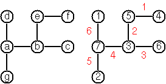
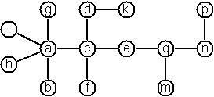

# GLPK Graceful Tree Labeling

This repo contains a solution to the [graceful tree labeling problem](https://en.wikipedia.org/wiki/Graceful_labeling) using the [GNU Linear Programming Kit (GLPK)][GLPK] and GNU MathProg, an expressive, high-level language for modeling linear systems.

I first came across this as problem P92 of the [99 Lisp Problems] where it's called Von-Koch's conjecture. I wrote a [brute-force solution in lisp], but thought it would be fun to try solving it with a linear programming / mixed integer programming approach.

This is my first attempt at writing a MathProg model (or any kind of linear programming model, for that matter), so if you're looking for decent examples of idiomatic MathProg, you might want to check out the `examples` directory in the [GLPK] distribution. Or check out the examples included in the nifty [online-optimizer].

**Update:** As of GLPK v4.64, the file `graceful.mod` is now included in the `examples` directory in the [GLPK source distribution].

# Problem statement

Copy/pasted from the [99 Lisp Problems].

> **P92 (\*\*\*) Von Koch's conjecture**
>
> Several years ago I met a mathematician who was intrigued by a problem for which he didn't know a solution. His name was Von Koch, and I don't know whether the problem has been solved since.
>
>  
>
> Anyway the puzzle goes like this: given a tree with N nodes (and hence N-1 edges), find a way to enumerate the nodes from 1 to N and, accordingly, the edges from 1 to N-1 in such a way that, for each edge K, the difference of its node numbers equals K. The conjecture is that this is always possible.
>
> For small trees the problem is easy to solve by hand. However, for larger trees, and 14 is already very large, it is extremely difficult to find a solution. And remember, we don't know for sure whether there is always a solution!
>
> Write a function that calculates a numbering scheme for a given tree. What is the solution for the larger tree pictured above?

# Solution

Thanks to the expressive nature of MathProg, much of the solution follows naturally from the problem statement. There are a couple of tricks, however, that might be unfamiliar if, like me, you're new to linear programming.

## Expressing the uniqueness constraint with binary variables

In order to model the uniqueness constraint on the vertex labels, we use a two dimensional array of binary variables, `vx`, where the first index is the input vertex and the second index is the vertex label.

``` text
var vx{V, N}, binary;
```

`V` is the set of vertices and `N` is the set of vertex labels, i.e. `N = {1..|V|}`. If `vx[i,j] == 1`, then vertex `i` has label `j`, and for all `k != j`, `vx[i,k] == 0`.

An example might help. Suppose the input tree has three vertices, `a`, `b`, and `c`, and suppose we want to represent the state were they are assigned labels 1, 2, and 3, respectively. This state would be encoded as

``` text
vx[a,1] = 1; vx[a,2] = 0; vx[a,3] = 0
vx[b,1] = 0; vx[b,2] = 1; vx[b,3] = 0
vx[c,1] = 0; vx[c,2] = 0; vx[c,3] = 1
```

Or, in tabular form

|   | 1 | 2 | 3 |
|---|---|---|---|
| a | 1 | 0 | 0 |
| b | 0 | 1 | 0 |
| c | 0 | 0 | 1 |

If you're familiar with machine learning concepts, you might recognize this representation as being similar to one-hot encoding.

Using this binary encoding, we can express the uniqueness constraint on the vertex labels as follows:

``` text
s.t. vxa{v in V}: sum{n in N} vx[v,n] = 1;
/* each vertex is assigned exactly one label. */

s.t. vxb{n in N}: sum{v in V} vx[v,n] = 1;
/* each label is assigned to exactly one vertex. */
```

Taken together, the above two constraints specify that every row and column of the tabular representation contains exactly one 1.

We can then map the binary encoding back into integer variables with the following constraint:

``` text
s.t. vla{v in V}: vl[v] = sum{n in N} n * vx[v,n];
/* by constraint vxa, exactly one of vx[v,n] == 1 and the rest are
   zero. So if vx[v,3] == 1, then vl[v] = 3. */
```

For the three vertex tree we described above, this constraint amounts to:

``` text
vl[a] = 1*vx[a,1] + 2*vx[a,2] + 3*vx[a,3]
      = 1*1 + 2*0 + 3*0
	  = 1

vl[b] = 1*vx[b,1] + 2*vx[b,2] + 3*vx[b,3]
      = 1*0 + 2*1 + 3*0
	  = 2

vl[c] = 1*vx[c,1] + 2*vx[c,2] + 3*vx[c,3]
      = 1*0 + 2*0 + 3*1
	  = 3
```

The same strategy is used to express the uniqueness constraint on edge labels, with corresponding variables `ex` for the binary representation and `el` for integer representation.

The file `examples/sudoku.mod` in the GLPK source distribution uses a similar technique for expressing the various sudoku uniqueness constraints.


## Modeling the absolute value constraint

MathProg has an absolute value function, so it seemed natural to express the absolute value constraint on the edge labels like so:

``` text
var el{E}, integer, >= 1, <= card(E);
/* el[u,v] == n means edge (u,v) has label n. */

s.t. elb{(u,v) in E}: el[u,v] = abs(vl[u] - vl[v]);
```

where `E` is the set of edges in the input tree.

Attempting to solve the model, however, will cause GLPSOL to complain that the argument to `abs` has invalid type.

``` shell
$ glpsol -m abs.mod --check
GLPSOL: GLPK LP/MIP Solver, v4.63
Parameter(s) specified in the command line:
 -m abs.mod --check
Reading model section from abs.mod...
abs.mod:63: argument for abs has invalid type
Context:  u , v ) in E } : el [ u , v ] = abs ( vl [ u ] - vl [ v ] )
MathProg model processing error
```

The problem (I think) is that the absolute value is not a linear function, and GLPSOL requires linear constraints. So we need a way to model the absolute value constraint as one or more linear constraints. Luckily, the [lpsolve docs][lpsolve-abs] provide a hint. Basically, we introduce a binary variable, `gt`, and arrange that `gt[u,v] == 1` when `vl[u] > vl[v]` and `gt[u,v] == 0` when `vl[u] < vl[v]`. Note that `vl[u] != vl[v]` due to the uniqueness constraints described above. We then use the variable `gt` to help express the absolute value constraint, like so:

``` text
var gt{E}, binary;
/* gt[u,v] = 1 if vl[u] > vl[v] else 0.
   gt helps encode the absolute value constraint, below. */

s.t. elb{(u,v) in E}: el[u,v] >= vl[u] - vl[v];
s.t. elc{(u,v) in E}: el[u,v] <= vl[u] - vl[v] + 2*card(V)*(1-gt[u,v]);
s.t. eld{(u,v) in E}: el[u,v] >= vl[v] - vl[u];
s.t. ele{(u,v) in E}: el[u,v] <= vl[v] - vl[u] + 2*card(V)*gt[u,v];
```

When `vl[u] > vl[v]` and `gt[u,v] == 1`, then `elb` and `elc` model the absolute value constraint, and `eld` and `ele` are essentially inactive, since they specify looser bounds than the bounds already placed on `el` when it was declared, namely `1 <= el[u,v] <= card(E)`.

When `vl[v] > vl[u]` and `gt[u,v] == 0`, then `eld` and `ele` model the absolute value constraint, and `elb` and `elc` are inactive.

See [the comment attached to these constraints] in the file `graceful.mod` for more info.


# Running the tests

## With a local GLPK install

You need [GLPK] installed, including the `glpsol` command line solver. The model in this repo has been tested with GLPSOL v4.63.

To find a solution for the tree given by `t1.dat`, run `make t1`. Likewise for any of the other `t*.dat` files.

You can also invoke `glpsol` directly, like so:

``` shell
glpsol -m graceful.mod -d t1.dat <additional-options>
```

For the smaller trees, t1 - t4, the default search options are fine. For the larger trees, however, specifying non-default search options can greatly reduce the runtime. See the `Makefile` for examples.

# With GLPK in the browser

If you want to try out the model but don't want to install GLPK, there is an amazing webapp called the [online-optimizer] that lets you run MathProg models in the browser using [GLPK.js]. What a time to be alive!

I've uploaded `graceful.mod` and `t1.dat` to the online-optimizer, [here](https://online-optimizer.appspot.com/?model=ms:oH71V171yQZrDP5rh9UTkaAEqcc3p1ja). Hopefully, that link is persistent. If the link works, you'll be looking at the **Documentation** page, which is (unfortunately) blank. You'll want to click on the **Model** link in the left-hand navigation menu to see the model, or click on the green **Solve model** button at the bottom to run the solver.

In case the above link doesn't work, you can choose **Model > New Model** from the drop-down menu at the top, then click on the **Model** link in the left-hand navigation menu and paste in the concatenation of `graceful.mod` and `t1.dat`, in that order, making sure to remove the `end;` that occurs as the final line of `graceful.mod`. That is, only a single `end;` should occur as the last line of the model. The concatenated model and data section should look something like this:

``` text
/* Graceful Tree Labeling Problem */

... contents of graceful.mod, minus final "end;" statement ...

/* no "end;" here! */
data;

... definitions for set V and set E ...

end;
```

[GLPK]: https://www.gnu.org/software/glpk/
[GLPK source distribution]: https://ftp.gnu.org/gnu/glpk/
[GLPK.js]: http://hgourvest.github.io/glpk.js/
[online-optimizer]: https://online-optimizer.appspot.com/
[99 Lisp Problems]: http://www.ic.unicamp.br/~meidanis/courses/mc336/problemas-lisp/L-99_Ninety-Nine_Lisp_Problems.html
[brute-force solution in lisp]: https://github.com/appleby/99-lisp-problems/blob/master/p92.lisp
[lpsolve-abs]: http://lpsolve.sourceforge.net/5.5/absolute.htm
[the comment attached to these constraints]: https://github.com/appleby/graceful-tree/blob/master/graceful.mod#L63
